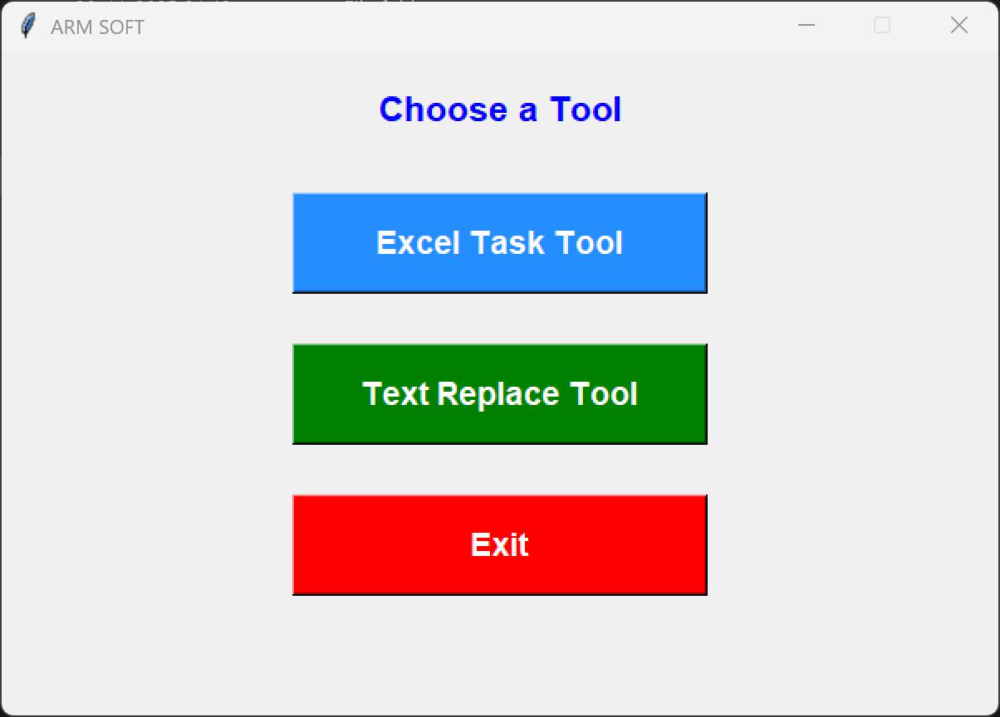
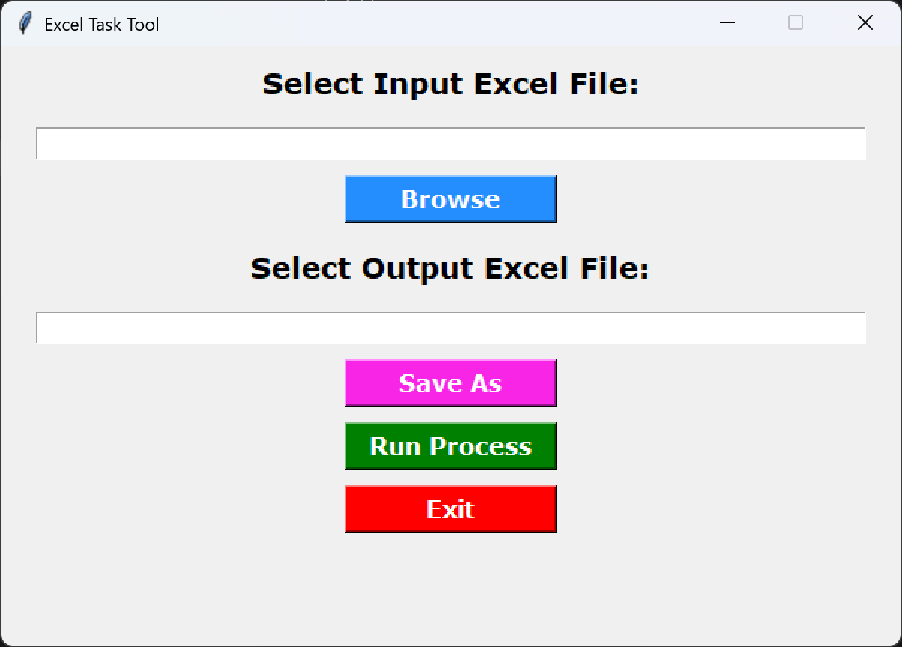
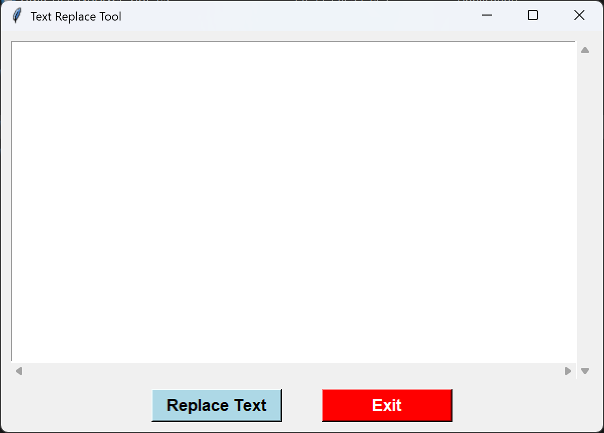
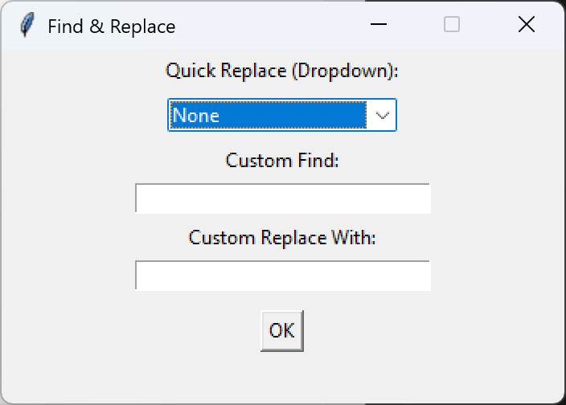
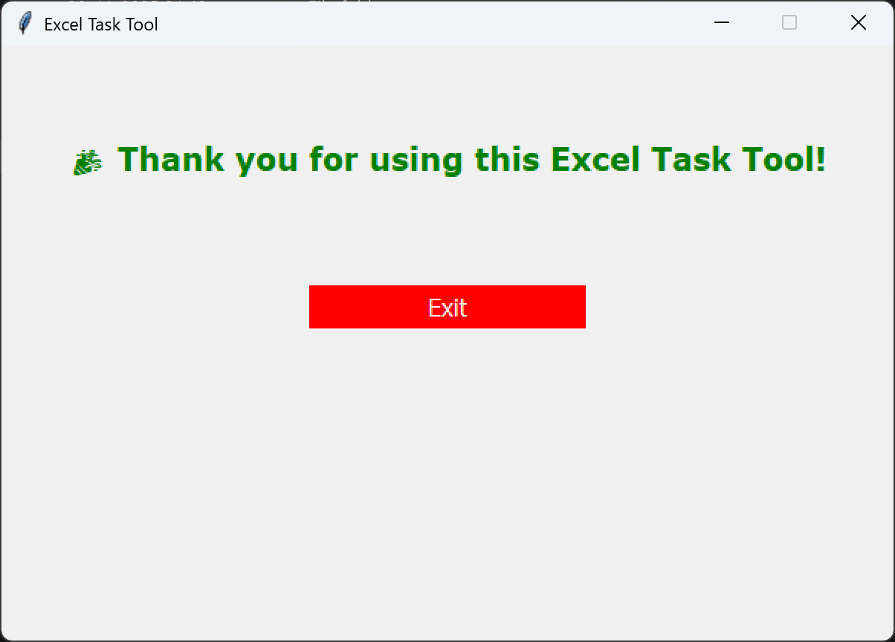
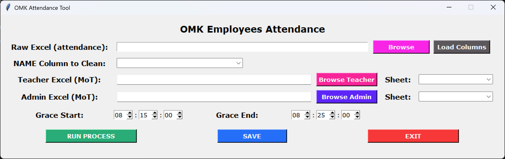
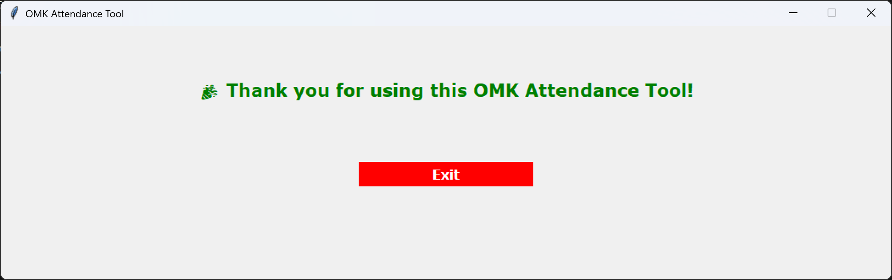

<h1 align="center">📊 OMK Attendance Processing Tool</h1>

<p align="center">
A complete automated attendance processing system built using <b>Python + Tkinter + Pandas</b>
</p>

---

## <p align="center">🚀 Status & Technology Badges</p>

<p align="center">


</p>

---

# 🧩 Overview

**OMK Attendance Processing System** is a **GUI-based automated attendance checker** built using Python, Tkinter, and Pandas.
It processes daily attendance sheets from **teachers, admin staff, transport, guard and 4th grade**, applies **grace logic**, finds missing entries, and generates clean Excel/CSV reports instantly.

✔ Import attendance raw data files  
✔ Import Admin & Teacher Supervision data files   
✔ Auto-detect sheets & show as dropdown  
✔ Apply **grace-time rules**  
✔ Detect late arrival  
✔ Standardize time formats  
✔ Error handling  
✔ Export results to Excel or CSV  

---

# 📘 UML Workflow Diagram


## 📌 ASCII Version
            ┌──────────────────────────┐
            │     Start Application    │
            └─────────────┬────────────┘
                          │
            ┌─────────────▼─────────────┐
            │  User Selects Excel File  │
            │    (Admin + Teacher)      │
            └─────┬──────────────┬──────┘
                  │              │
            ┌─────▼─────┐  ┌─────▼─────┐
            │Load Sheets│  │Load Sheets│
            └─────┬─────┘  └─────┬─────┘
                  │              │
            ┌─────▼──────────────▼───┐
            │      Show Dropdown     │
            └────────────┬───────────┘
                         │
            ┌────────────▼───────────┐
            |   Apply Grace Logic    |
            |   Format + Normalize   | 
            |   Detect Late/Absent   | 
            |         & MoT          | 
            └────────────┬───────────┘
                         │
               ┌─────────▼──────────┐
               │ Error Handling +   │
               │ Data Validation    │
               └─────────┬──────────┘
                         │
               ┌─────────▼──────────┐
               │   Export Output    │
               │ (CSV / XLSX files) │
               └─────────┬──────────┘
                         │
               ┌─────────▼──────────┐
               │      Complete      │
               └────────────────────┘


---

# 🧠 Features

### 🖥 GUI (Tkinter)

* Browse Excel files
* Auto-detect & show sheet list
* Set grace time
* Run processing
* Save output

### ⏱ Attendance Processing

* Extract IN & OUT time
* Convert inconsistent formats
* Apply late-entry logic
* Identify incorrect or missing entries

### 📊 Export Options

* `.csv` combined
* `.xlsx` multi-sheet

---

## ⚙️ Tech Stack

| Area       | Technologies                |
| ---------- | --------------------------- |
| Language   | Python                      |
| GUI        | Tkinter                     |
| Data       | Pandas                      |
| File Types | Excel, CSV                  |
| Packaging  | Windows executable optional |

---

# 📁 Project Structure

```
OMK-Attendance/
│
├── OMK_ATTENDANCE_GUI.exe         # exemain_frame
├── main_frame.py                  # GUI Main script
├── omkAttendance.py               # CMD Main script
├── OMK_ATTENDANCE_GUI.py          # 1st version attendance script
├── OMK_ATTENDANCE_GUI_1.5.py      # latest version attendance script
├── requirements.txt               # Dependencies
└── README.md
```

---

# 🎞 **Preview**

## 🖥️ Old Version

<p float="left">
  
  
</p>
<p float="left">
  
  
</p>
<p align="center">
  
</p>

## 🆕 Latest Version

<p align="center">
  
</p>
<p align="center">
  
</p>

---

# 🛠 Installation

### 1️⃣ Clone the Repo

```bash
git clone https://github.com/abhijeetraj22/OMK_ATTENDANCE_GUI.git
cd OMK_ATTENDANCE_GUI
```

### 2️⃣ Install Dependencies

```bash
pip install -r requirements.txt
```
### `requirements.txt`

```
pandas
openpyxl
xlrd
XlsxWriter
tk
```

### 3️⃣ Run the Tool

```bash
python attendance_tool.py
```

---

# 🧪 Output Example

| Employee ID | Name          | Role    | In Time | Out Time |  MoT | Att |  Late   | 
| ----------- | ------------- | ------- |-------- | -------- | ---- | --- |  -----  |
| 1024        | Rohan Sharma  | Teacher | 07:52   | 14:11    |  SUP |  PR | ON TIME |
| 524         | Vishal Goswami| Teacher | 08:22   | 17:11    |  SUP |  PR | ADV     |
| 5498        | Abhijeet Raj  | Admin   | 08:12   | 16:21    |  TRN |  PR | ON TIME |
| 824         | Abhishek      | Guard   |   --    |   --     |  SUP |  AB |         | 
| 1893        | Raju Verma    | Driver  | 08:32   | 15:01    |  SUP |  PR | LATE    |


---

# 🧾 Grace Time Logic (Configurable)

```
Arrival < 08:15   → On Time  
08:15 – 08:25     → Adv  
>08:25            → Late
```

---

# ⭐ What Makes This Tool Special?

✔ Zero manual data formatting  
✔ Fully GUI driven  
✔ Grace logic per school rules  
✔ One-click Excel export  
✔ Real-world tested  
✔ Easy to deploy  

---

# 📜 License

MIT License

---

# ⭐ Support the Project

If you found this tool helpful:

👉 **Star ⭐ the repo**  
👉 Share with team  
👉 Follow on GitHub  

---

# 🌐 Connect With Me

[](https://www.linkedin.com/in/rajabhijeet22/)
[](https://github.com/abhijeetraj22)
[](https://www.instagram.com/abhijeet_raj_/)
[](https://twitter.com/abhijeet_raj_/)
